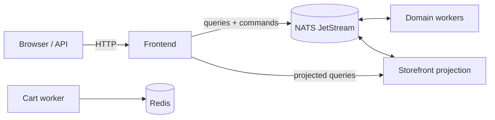

# Online Boutique with NATS

This repository runs the Online Boutique microservices demo on any conformant
Kubernetes cluster. It uses Kubernetes resources, a container registry, and
NATS for the event-driven workflows; no provider-specific services are
required.

## Architecture

Online Boutique is composed of microservices written in Go, C#, Node.js,
Python, and Java. Deployed business interactions use NATS commands, events,
bounded queries, storefront projections, and durable checkout processing. HTTP
is used at the frontend edge and for pod-local health/metrics only.



Find Protocol Buffer definitions in [`protos`](protos). The deployed request
flows are documented in [Current service interactions](docs/current-service-interactions.md),
and the NATS migration design is in the [NATS event-driven upgrade plan](docs/nats-event-driven-upgrade-plan.md).

| Service | Language | Description |
| --- | --- | --- |
| [frontend](src/frontend) | Go | Browser-facing web application. |
| [cartservice](src/cartservice) | C# | Shopping cart storage and cart commands. |
| [productcatalogservice](src/productcatalogservice) | Go | Product catalogue. |
| [currencyservice](src/currencyservice) | Node.js | Currency conversion. |
| [paymentservice](src/paymentservice) | Node.js | Mock payment processing. |
| [shippingservice](src/shippingservice) | Go | Mock shipping quotes and fulfilment. |
| [emailservice](src/emailservice) | Python | Order notifications. |
| [checkoutservice](src/checkoutservice) | Go | Checkout orchestration. |
| [recommendationservice](src/recommendationservice) | Python | Product recommendations. |
| [adservice](src/adservice) | Java | Contextual advertisements. |
| [storefrontprojectionservice](src/storefrontprojectionservice) | Go | NATS-backed storefront read model. |

## Quickstart

Requirements:

- A Kubernetes cluster and `kubectl` context with cluster-admin access.
- A default dynamic `StorageClass`. The NATS and application PVCs deliberately
  do not contain node names, host paths, or static PV references.
- Docker and access to a container registry for application images.

Clone this repository:

```sh
git clone https://github.com/Matslo1234/microservices-demo-nats.git
cd microservices-demo-nats
```

### 1. Provide dynamic storage

If `kubectl get storageclass` shows no default class, install a provisioner. For
a development or test cluster, Rancher's local-path provisioner is a simple
option:

```sh
kubectl apply -f https://raw.githubusercontent.com/rancher/local-path-provisioner/v0.0.36/deploy/local-path-storage.yaml

kubectl annotate storageclass local-path \
  storageclass.kubernetes.io/is-default-class=true \
  --overwrite

kubectl get storageclass
```

Local-path storage is tied to the selected node and is appropriate for
development or testing. For durable multi-node storage, install the CSI driver
for your storage platform and mark its StorageClass as the default instead.

### 2. Install NATS

Apply NATS before the application. The setup Deployment creates missing broker
TLS, auth, and JetStream-encryption Secrets without rotating existing values.
It synchronizes the client CA and workload credentials from those broker
Secrets so a retained application namespace cannot keep stale connection data.

```sh
kubectl apply -k kubernetes-manifests/nats/fresh-cluster
kubectl -n nats rollout status deployment/nats-setup --timeout=5m
kubectl -n nats rollout status statefulset/nats --timeout=10m
kubectl -n nats wait --for=condition=complete job/nats-bootstrap --timeout=5m
```

Optionally run the NATS acceptance checks:

```sh
bash scripts/nats/verify.sh
```

### 3. Deploy the application


Note: the application requires a working NATS setup. Verify that NATS is running before you deploy the application.

The catalog and currency deployments publish their deterministic initial
snapshots to JetStream during startup. The frontend waits for the storefront
projection to consume those snapshots before it becomes ready, so a fresh
installation does not expose an uninitialized storefront.

You can use the release manifest (replace its image prefix/tag when publishing
your own build):

```sh
kubectl apply -f release/kubernetes-manifests.yaml
```

Check the status of the deploy. Wait for all pods to start.
```sh
kubectl get pods
```

Once the deploy finishes you can access the application via the ip of the LoadBalancer. Use CLUSTER-IP if running the cluster locally or EXTERNAL-IP if running on a remote cluster.
```sh
kubectl get service frontend-external
```

## Operations and development

- [NATS Phase 1 runbook](docs/development/nats-phase1-runbook.md): deployment,
  verification, backups, recovery, and credential rotation.
- [Development guide](docs/development-guide.md): local development workflow.
- [Kustomize configuration](kustomize): deployment customisation options.
