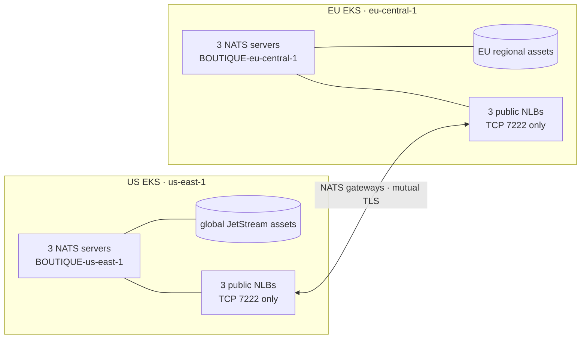

# AWS EKS NATS supercluster runbook

This repository currently connects two independent three-server NATS clusters:

| Role | AWS region | EKS cluster | kubectl context | NATS cluster |
| --- | --- | --- | --- | --- |
| Primary | `us-east-1` | `eks-cluster` | `arn:aws:eks:us-east-1:301085418229:cluster/eks-cluster` | `BOUTIQUE-us-east-1` |
| Secondary | `eu-central-1` | `eu-central-1-cluster` | `nats-eu-central-1` | `BOUTIQUE-eu-central-1` |

Each region keeps its own local NATS route mesh. NATS gateways join those
clusters across the WAN, so they form a supercluster without stretching NATS
routes between continents.



Client `4222`, route `6222`, monitor `8222`, and metrics `7777` remain
Kubernetes-internal. The public NLBs have one TCP listener, on `7222`.

## Why the gateway NLBs are public

Both EKS VPCs use `172.31.0.0/16`, and both Kubernetes Service networks use
`10.100.0.0/16`. AWS does not allow VPC peering between overlapping CIDR
blocks. This deployment therefore uses internet-facing NLBs for the one NATS
gateway port instead of VPC peering.

The public source range is necessarily `0.0.0.0/0` because the worker nodes do
not have stable egress addresses. This exposes the TCP socket, not an
authenticated NATS session. Gateway access is protected by all of the
following:

- a private CA shared only by the two gateway configurations;
- mutual TLS with `verify: true` and TLS 1.2 or newer;
- leaf certificate SANs containing the exact NLB DNS names;
- `reject_unknown_cluster: true`; and
- exact remote names, `BOUTIQUE-us-east-1` and
  `BOUTIQUE-eu-central-1`.

For a fully private design, create new non-overlapping VPCs or use bidirectional
AWS PrivateLink endpoint services. To narrow the public source ranges, first
give each cluster stable NAT Gateway Elastic IPs, then replace `0.0.0.0/0` in
both gateway Services and gateway NetworkPolicies with those `/32` addresses.

AWS documents the overlap restriction in
[How VPC peering works](https://docs.aws.amazon.com/vpc/latest/peering/vpc-peering-basics.html).
The NLB/IP-target model is described in
[Route TCP and UDP traffic with Network Load Balancers](https://docs.aws.amazon.com/eks/latest/userguide/network-load-balancing.html).

## Use both clusters with kubectl

Recreate either context on a workstation with a valid AWS login as follows:

```sh
aws eks update-kubeconfig --region us-east-1 --name eks-cluster
aws eks update-kubeconfig --region eu-central-1 \
  --name eu-central-1-cluster --alias nats-eu-central-1

kubectl config get-contexts
kubectl --context arn:aws:eks:us-east-1:301085418229:cluster/eks-cluster get nodes
kubectl --context nats-eu-central-1 get nodes
```

Prefer `--context` on every command and script. `kubectl config use-context`
changes the default only; it does not remove the other context:

```sh
kubectl config use-context nats-eu-central-1
kubectl config current-context
```

If a long rollout ends with `CreateOAuth2Token` or `get-token` errors, refresh
the configured AWS login and verify it before resuming:

```sh
aws sts get-caller-identity
kubectl --context nats-eu-central-1 get nodes
```

## Current network endpoints

US gateway seeds:

```text
k8s-nats-natsgate-20ecb3bc11-aecd78d3074202c8.elb.us-east-1.amazonaws.com:7222
k8s-nats-natsgate-94d9321d7b-e1cc0fc025b842fd.elb.us-east-1.amazonaws.com:7222
k8s-nats-natsgate-f5042541ac-3b35793a02898133.elb.us-east-1.amazonaws.com:7222
```

EU gateway seeds:

```text
k8s-nats-natsgate-2c2a33a54d-a5259d04fb10ed85.elb.eu-central-1.amazonaws.com:7222
k8s-nats-natsgate-8f9a9906cb-6a59ef3d4ff84f12.elb.eu-central-1.amazonaws.com:7222
k8s-nats-natsgate-a22d86f61f-f6737fcb872d12be.elb.eu-central-1.amazonaws.com:7222
```

These names are recorded in:

- `kubernetes-manifests/regions/aws-supercluster-inventory.yaml`;
- each region's `region-config.yaml`; and
- the opposite region's `gateway-config.yaml`.

Deleting or recreating a gateway Service can change its NLB hostname. When
that happens, update all three locations and reissue the affected gateway
certificate before rolling out NATS.

## Reproduce or repair the deployment

Set the explicit identities once for the commands below:

```sh
PRIMARY_CONTEXT='arn:aws:eks:us-east-1:301085418229:cluster/eks-cluster'
SECONDARY_CONTEXT='nats-eu-central-1'
INVENTORY='kubernetes-manifests/regions/aws-supercluster-inventory.yaml'
```

### 1. Install EKS prerequisites

Run this once for a fresh cluster. It installs the EBS CSI add-on with EKS Pod
Identity, makes encrypted `gp3` the default StorageClass, and installs the AWS
Load Balancer Controller:

```sh
bash scripts/nats/install-eks-prerequisites.sh \
  --cluster-name eu-central-1-cluster \
  --context "${SECONDARY_CONTEXT}" \
  --region eu-central-1 \
  --vpc-id vpc-03b7b806f69cecbac
```

The corresponding US VPC is `vpc-0995fa83c4f5d27c3`.

### 2. Provision the gateway endpoints

The regional overlays already contain the correct NLB subnets. The Services
use internet-facing NLBs with IP targets and one ordinal pod per NLB:

```sh
kubectl --context "${PRIMARY_CONTEXT}" apply \
  -f kubernetes-manifests/nats/overlays/supercluster/us-east-1/gateway-services.yaml

kubectl --context "${SECONDARY_CONTEXT}" apply \
  -f kubernetes-manifests/nats/base/namespace.yaml
kubectl --context "${SECONDARY_CONTEXT}" apply \
  -f kubernetes-manifests/nats/overlays/supercluster/eu-central-1/gateway-services.yaml

kubectl --context "${SECONDARY_CONTEXT}" -n nats get service \
  nats-gateway-0 nats-gateway-1 nats-gateway-2 \
  -o custom-columns=NAME:.metadata.name,HOST:.status.loadBalancer.ingress[0].hostname
```

Health checks use pod port `8222`, but no public NLB listener exposes that
port. The gateway NetworkPolicy permits health probes only from the region's
NLB subnet CIDRs.

### 3. Copy the one intentionally global application Secret

The secondary setup controller verifies that both regions share the business
keys used for cookies, payment signatures, and the shipping provider. Transfer
that Secret directly between Kubernetes APIs without printing or writing its
payload:

```sh
kubectl --context "${PRIMARY_CONTEXT}" -n default get secret \
  global-application-secrets -o json | \
  jq 'del(.metadata.creationTimestamp,.metadata.resourceVersion,.metadata.uid,.metadata.managedFields) | .metadata.namespace="default"' | \
  kubectl --context "${SECONDARY_CONTEXT}" apply -f -
```

Do not copy `nats-server-auth`, the client/route CA, or the JetStream encryption
key. The setup controller generates those separately in each cluster.

### 4. Issue gateway certificates

The shared CA is retained as `nats-gateway-ca` in the US `nats` namespace.
The helper generates a leaf key and CSR, mounts the CA in a short-lived signer
Job in US, and sends only the resulting leaf Secret to the target context. An
existing CA private key never leaves the US cluster.

```sh
US_DNS='k8s-nats-natsgate-20ecb3bc11-aecd78d3074202c8.elb.us-east-1.amazonaws.com,k8s-nats-natsgate-94d9321d7b-e1cc0fc025b842fd.elb.us-east-1.amazonaws.com,k8s-nats-natsgate-f5042541ac-3b35793a02898133.elb.us-east-1.amazonaws.com'
EU_DNS='k8s-nats-natsgate-2c2a33a54d-a5259d04fb10ed85.elb.eu-central-1.amazonaws.com,k8s-nats-natsgate-8f9a9906cb-6a59ef3d4ff84f12.elb.eu-central-1.amazonaws.com,k8s-nats-natsgate-a22d86f61f-f6737fcb872d12be.elb.eu-central-1.amazonaws.com'

bash scripts/nats/generate-gateway-pki.sh \
  --ca-context "${PRIMARY_CONTEXT}" \
  --target-context "${PRIMARY_CONTEXT}" \
  --dns-names "${US_DNS}"

bash scripts/nats/generate-gateway-pki.sh \
  --ca-context "${PRIMARY_CONTEXT}" \
  --target-context "${SECONDARY_CONTEXT}" \
  --dns-names "${EU_DNS}"
```

Back up `nats-gateway-ca` in an encrypted secret manager. Losing its private
key prevents issuing replacement peer certificates.

### 5. Validate and deploy

The inventory and rendered-role validators reject inconsistent region,
cluster, stream-owner, or primary/secondary configuration:

```sh
python3 scripts/nats/validate-regions.py --inventory "${INVENTORY}"

kubectl kustomize \
  kubernetes-manifests/nats/overlays/supercluster/us-east-1 > /tmp/nats-us.yaml
python3 scripts/nats/validate-rendered.py \
  --manifest /tmp/nats-us.yaml --region us-east-1 --role primary

kubectl kustomize \
  kubernetes-manifests/nats/overlays/supercluster/eu-central-1 > /tmp/nats-eu.yaml
python3 scripts/nats/validate-rendered.py \
  --manifest /tmp/nats-eu.yaml --region eu-central-1 --role secondary
```

Deploy the primary first and the secondary second. The primary safely retries
the EU seeds while EU starts:

```sh
bash scripts/nats/deploy.sh \
  --context "${PRIMARY_CONTEXT}" \
  --region us-east-1 --role primary --inventory "${INVENTORY}"

bash scripts/nats/deploy.sh \
  --context "${SECONDARY_CONTEXT}" \
  --region eu-central-1 --role secondary --inventory "${INVENTORY}"
```

The secondary overlay removes the global bootstrap, global advisory watcher,
and backup owner. Global streams remain owned by `BOUTIQUE-us-east-1`; EU
creates only its region-qualified KV/object assets and consumer identities.

## Verify the supercluster

Each gateway view must contain a configured outbound connection and an inbound
connection for the opposite cluster. Connections should report TLS:

```sh
kubectl --context "${PRIMARY_CONTEXT}" -n nats exec nats-0 -c nats -- \
  wget -qO- http://127.0.0.1:8222/gatewayz | jq .

kubectl --context "${SECONDARY_CONTEXT}" -n nats exec nats-0 -c nats -- \
  wget -qO- http://127.0.0.1:8222/gatewayz | jq .
```

Run the acceptance job explicitly in EU. Its successful access to the
US-owned global streams exercises the gateway in addition to testing
permissions, deduplication, replay, MaxDeliver, and live Core NATS delivery:

```sh
bash scripts/nats/verify.sh --context "${SECONDARY_CONTEXT}"
```

Check local health and storage independently in both regions:

```sh
kubectl --context "${PRIMARY_CONTEXT}" -n nats get pods,pvc,jobs
kubectl --context "${SECONDARY_CONTEXT}" -n nats get pods,pvc,jobs
```

## Benchmark cross-region events and connection recovery

Run the external benchmark from a workstation with administrative access to
both kubectl contexts:

```sh
python3 benchmark/supercluster/supercluster_benchmark.py --events 100
```

It measures both regional directions with per-event Core NATS delivery and
JetStream R1-versus-R3 publish/delivery timings, reports median and population
standard deviation, verifies replica health through both clusters, and drops
only the receiving workstation port-forward to compare Core loss with durable
JetStream recovery. It does not edit broker configuration or restart cluster
workloads. See
[`benchmark/supercluster/README.md`](../benchmark/supercluster/README.md) for
the safety model, output artifacts, options, and interpretation guidance.

The NATS pods already include the Prometheus exporter with gateway and full
JetStream collection, so this benchmark requires no additional metrics
deployment.

NATS explains why gateways connect independent WAN-separated clusters and
forward only traffic with remote interest in the
[supercluster documentation](https://docs.nats.io/learn/topologies/super-clusters).
Its [TLS documentation](https://docs.nats.io/learn/security/encryption)
describes per-connection TLS and mutual certificate verification.

## Application deployments and endpoints

The application overlays pin the most recently pushed Docker Hub release,
`matslo123/*:v0.7.0`, by immutable digest:

- `regional-manifests/regions/us-east-1` deploys the full 13-service
  application and both six-member Redis clusters;
- `regional-manifests/regions/eu-central-1` deploys two replicas each of
  frontend, payment, and storefront projection; primary-only workers remain
  in US and are reached through NATS; and
- each `frontend-external` Service is an internet-facing, IP-target NLB with
  one HTTP listener on port `80`. The primary US region also exposes the
  benchmark API and UI through an equivalent `benchmarkservice-external` NLB.

The current URLs are:

```text
US: http://k8s-default-frontend-66abe7078c-cd86c721bfb049ce.elb.us-east-1.amazonaws.com
EU: http://k8s-default-frontend-93371dc1f6-c391ee1151b1809e.elb.eu-central-1.amazonaws.com
```

The four-node US `t3.medium` node group cannot schedule two replicas of every
stateless service alongside NATS and the 12 Redis members. Its overlay
therefore sets every stateless Deployment and HPA to a fixed single replica.
Increase US node-group capacity before raising those HPA maxima. The lighter
EU regional subset remains at two replicas.

Reapply just the checked-in application overlays without restarting NATS:

```sh
kubectl kustomize regional-manifests/regions/us-east-1 > /tmp/app-us.yaml
python3 scripts/nats/validate-rendered.py \
  --manifest /tmp/app-us.yaml --region us-east-1 --role primary --application
kubectl --context "${PRIMARY_CONTEXT}" apply -f /tmp/app-us.yaml

kubectl kustomize regional-manifests/regions/eu-central-1 > /tmp/app-eu.yaml
python3 scripts/nats/validate-rendered.py \
  --manifest /tmp/app-eu.yaml --region eu-central-1 --role secondary --application
kubectl --context "${SECONDARY_CONTEXT}" apply -f /tmp/app-eu.yaml
```

Check the endpoints and regional workloads:

```sh
kubectl --context "${PRIMARY_CONTEXT}" -n default get service frontend-external benchmarkservice-external
kubectl --context "${SECONDARY_CONTEXT}" -n default get service frontend-external
curl --fail http://k8s-default-frontend-66abe7078c-cd86c721bfb049ce.elb.us-east-1.amazonaws.com/
curl --fail http://k8s-default-frontend-93371dc1f6-c391ee1151b1809e.elb.eu-central-1.amazonaws.com/
```

These endpoints currently use plain HTTP. Add ACM certificates and an HTTPS
load-balancing layer before transmitting production customer data.
