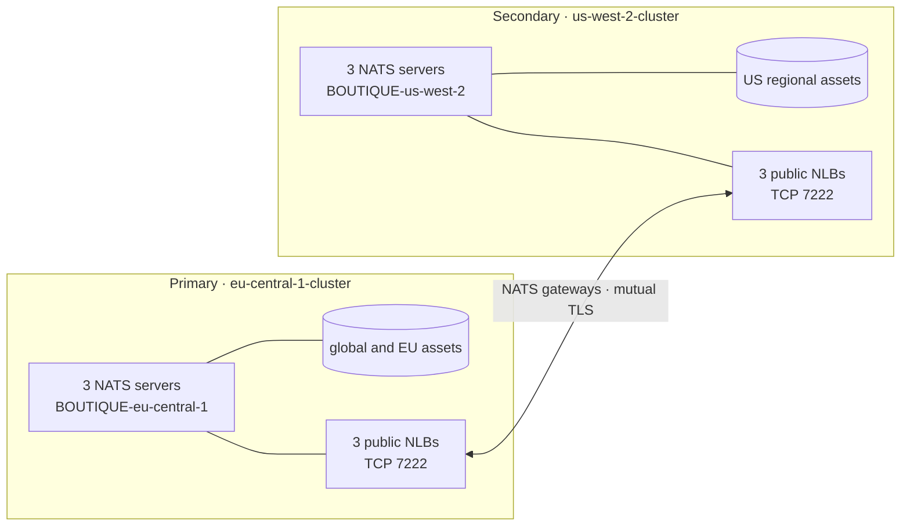

# AWS EKS NATS supercluster runbook

This repository connects two three-server NATS clusters:

| Role | AWS region | EKS cluster | kubectl context | NATS cluster |
| --- | --- | --- | --- | --- |
| Primary | `eu-central-1` | `eu-central-1-cluster` | `arn:aws:eks:eu-central-1:301085418229:cluster/eu-central-1-cluster` | `BOUTIQUE-eu-central-1` |
| Secondary | `us-west-2` | `us-west-2-cluster` | `us-west-2-cluster` | `BOUTIQUE-us-west-2` |

Each region keeps a local NATS route mesh. Mutual-TLS gateways join the route
meshes across the WAN without stretching route connections between regions.
Global JetStream assets are placed in the EU primary. Region-qualified KV and
object-store assets remain in their owning region.


```mermaid
flowchart LR
  subgraph EU[Primary · eu-central-1-cluster]
    EUN[3 NATS servers\nBOUTIQUE-eu-central-1]
    EUJ[(global and EU assets)]
    EUG[3 public NLBs\nTCP 7222]
    EUN --- EUJ
    EUN --- EUG
  end
  subgraph US[Secondary · us-west-2-cluster]
    USN[3 NATS servers\nBOUTIQUE-us-west-2]
    USJ[(US regional assets)]
    USG[3 public NLBs\nTCP 7222]
    USN --- USJ
    USN --- USG
  end
  EUG <-->|NATS gateways · mutual TLS| USG
```

Client `4222`, route `6222`, monitor `8222`, and metrics `7777` remain
Kubernetes-internal. Only gateway port `7222` has a public NLB listener.

## Network design

Both EKS VPCs use `172.31.0.0/16`, and both Kubernetes Service networks use
`10.100.0.0/16`. AWS does not permit VPC peering between overlapping CIDRs, so
the gateway port uses internet-facing NLBs. The TCP socket is protected by a
private shared gateway CA, mutual TLS with peer verification, exact certificate
SANs, and exact remote NATS cluster names.

Use non-overlapping VPCs or bidirectional PrivateLink endpoint services for a
fully private design. Stable NAT Gateway Elastic IPs would also allow replacing
the current `0.0.0.0/0` NLB source range with explicit `/32` addresses.

See AWS documentation for [VPC peering restrictions](https://docs.aws.amazon.com/vpc/latest/peering/vpc-peering-basics.html)
and [EKS Network Load Balancers](https://docs.aws.amazon.com/eks/latest/userguide/network-load-balancing.html).

## Cluster identities and endpoints

```sh
PRIMARY_CONTEXT='arn:aws:eks:eu-central-1:301085418229:cluster/eu-central-1-cluster'
SECONDARY_CONTEXT='us-west-2-cluster'
INVENTORY='kubernetes-manifests/regions/aws-supercluster-inventory.yaml'
```

EU primary gateway endpoints:

```text
k8s-nats-natsgate-9a49a33457-855f8d42089a130e.elb.eu-central-1.amazonaws.com:7222
k8s-nats-natsgate-426435f5c8-9806ed35b9fd5bbc.elb.eu-central-1.amazonaws.com:7222
k8s-nats-natsgate-f5f85e6f3c-26aec2e4bb3bdb0e.elb.eu-central-1.amazonaws.com:7222
```

US secondary gateway endpoints:

```text
k8s-nats-natsgate-d96edcd91e-19472ad587b8fb54.elb.us-west-2.amazonaws.com:7222
k8s-nats-natsgate-7f106d94e8-3a80a58986e41979.elb.us-west-2.amazonaws.com:7222
k8s-nats-natsgate-c32581b19b-b5a99ba2fbf531e3.elb.us-west-2.amazonaws.com:7222
```

The names are recorded in the AWS inventory, each region's
`region-config.yaml`, and the opposite region's `gateway-config.yaml`. Reissue
the affected gateway certificate and update all three locations if recreating a
Service changes an NLB hostname.

## Reproduce or repair the deployment

### 1. Configure kubectl

```sh
aws eks update-kubeconfig --region eu-central-1 --name eu-central-1-cluster
aws eks update-kubeconfig --region us-west-2 --name us-west-2-cluster \
  --alias us-west-2-cluster

kubectl --context "${PRIMARY_CONTEXT}" get nodes
kubectl --context "${SECONDARY_CONTEXT}" get nodes
```

Use `--context` on every command. Refresh the configured AWS login with
`aws sts get-caller-identity` if EKS token creation fails during a rollout.

### 2. Install EKS prerequisites

The helper installs the EBS CSI add-on with Pod Identity, encrypted `gp3`, and
the AWS Load Balancer Controller:

```sh
bash scripts/nats/install-eks-prerequisites.sh \
  --cluster-name eu-central-1-cluster --context "${PRIMARY_CONTEXT}" \
  --region eu-central-1 --vpc-id vpc-03b7b806f69cecbac

bash scripts/nats/install-eks-prerequisites.sh \
  --cluster-name us-west-2-cluster --context "${SECONDARY_CONTEXT}" \
  --region us-west-2 --vpc-id vpc-071f4596865ba23bb
```

### 3. Provision gateway Services

```sh
kubectl --context "${PRIMARY_CONTEXT}" apply \
  -f kubernetes-manifests/nats/base/namespace.yaml
kubectl --context "${PRIMARY_CONTEXT}" apply \
  -f kubernetes-manifests/nats/overlays/supercluster/eu-central-1/gateway-services.yaml

kubectl --context "${SECONDARY_CONTEXT}" apply \
  -f kubernetes-manifests/nats/base/namespace.yaml
kubectl --context "${SECONDARY_CONTEXT}" apply \
  -f kubernetes-manifests/nats/overlays/supercluster/us-west-2/gateway-services.yaml
```

Each Service targets one StatefulSet ordinal. NLB health checks use pod port
`8222`, but no public listener exposes that port.

### 4. Issue gateway certificates

The gateway CA is retained as `nats-gateway-ca` in the EU primary. The helper
signs one leaf certificate per cluster and installs `nats-gateway-tls` without
moving the CA private key to the secondary.

```sh
EU_DNS='k8s-nats-natsgate-9a49a33457-855f8d42089a130e.elb.eu-central-1.amazonaws.com,k8s-nats-natsgate-426435f5c8-9806ed35b9fd5bbc.elb.eu-central-1.amazonaws.com,k8s-nats-natsgate-f5f85e6f3c-26aec2e4bb3bdb0e.elb.eu-central-1.amazonaws.com'
US_DNS='k8s-nats-natsgate-d96edcd91e-19472ad587b8fb54.elb.us-west-2.amazonaws.com,k8s-nats-natsgate-7f106d94e8-3a80a58986e41979.elb.us-west-2.amazonaws.com,k8s-nats-natsgate-c32581b19b-b5a99ba2fbf531e3.elb.us-west-2.amazonaws.com'

bash scripts/nats/generate-gateway-pki.sh \
  --ca-context "${PRIMARY_CONTEXT}" --target-context "${PRIMARY_CONTEXT}" \
  --dns-names "${EU_DNS}"

bash scripts/nats/generate-gateway-pki.sh \
  --ca-context "${PRIMARY_CONTEXT}" --target-context "${SECONDARY_CONTEXT}" \
  --dns-names "${US_DNS}"
```

Back up `nats-gateway-ca` in an encrypted secret manager.

### 5. Share the global application Secret

The secondary requires the same cookie, payment-signing, and shipping-provider
keys as the primary. This command transfers the Secret directly between the
Kubernetes APIs without writing or displaying its payload:

```sh
kubectl --context "${PRIMARY_CONTEXT}" -n default get secret \
  global-application-secrets -o json | \
  jq 'del(.metadata.creationTimestamp,.metadata.resourceVersion,.metadata.uid,.metadata.managedFields) | .metadata.namespace="default"' | \
  kubectl --context "${SECONDARY_CONTEXT}" apply -f -
```

Do not copy `nats-server-auth`, the client/route CA, or the JetStream encryption
key; those remain regional.

### 6. Validate and deploy

```sh
python3 scripts/nats/validate-regions.py --inventory "${INVENTORY}"

kubectl kustomize \
  kubernetes-manifests/nats/overlays/supercluster/eu-central-1 > /tmp/nats-eu.yaml
python3 scripts/nats/validate-rendered.py \
  --manifest /tmp/nats-eu.yaml --region eu-central-1 --role primary

kubectl kustomize \
  kubernetes-manifests/nats/overlays/supercluster/us-west-2 > /tmp/nats-usw.yaml
python3 scripts/nats/validate-rendered.py \
  --manifest /tmp/nats-usw.yaml --region us-west-2 --role secondary

bash scripts/nats/deploy.sh \
  --context "${PRIMARY_CONTEXT}" --region eu-central-1 --role primary \
  --inventory "${INVENTORY}"

bash scripts/nats/deploy.sh \
  --context "${SECONDARY_CONTEXT}" --region us-west-2 --role secondary \
  --inventory "${INVENTORY}"
```

Always deploy a fresh primary before a fresh secondary. The deployment helper
handles WAN bootstrap explicitly:

1. the empty primary uses `eu-central-1-bootstrap` to elect its local metadata
   leader before remote gateway seeds are enabled;
2. the primary switches to its normal three-seed gateway configuration;
3. the empty secondary uses `us-west-2-join` to add one voter to that leader;
   and
4. after the join is visible, the secondary scales to three voters.

This prevents the initial 3-vs-3 vote split caused by cross-region latency.

## Verify the supercluster

Each broker should report the same metadata leader, size `6`, quorum `4`, and
five peers. Gateway connections should report TLS 1.2 or newer.

```sh
for context in "${PRIMARY_CONTEXT}" "${SECONDARY_CONTEXT}"; do
  kubectl --context "${context}" -n nats get pods,pvc,jobs
  kubectl --context "${context}" -n nats exec nats-0 -c nats -- \
    wget -qO- http://127.0.0.1:8222/raftz | jq .
  kubectl --context "${context}" -n nats exec nats-0 -c nats -- \
    wget -qO- http://127.0.0.1:8222/gatewayz | jq .
done
```

Run the acceptance job from the secondary. It reaches the EU-owned global
streams and tests R3 health, deduplication, replay, MaxDeliver advisories,
permissions, and live Core NATS delivery:

```sh
bash scripts/nats/verify.sh --context "${SECONDARY_CONTEXT}"
```

The application workloads were not deployed as part of this cluster setup.
There is currently no `regional-manifests/regions/us-west-2` application
overlay, so do not pass `--application` for this topology until that overlay is
defined and validated.

NATS documents gateway behavior in its
[supercluster guide](https://docs.nats.io/learn/topologies/super-clusters) and
mutual TLS in its [encryption guide](https://docs.nats.io/learn/security/encryption).
