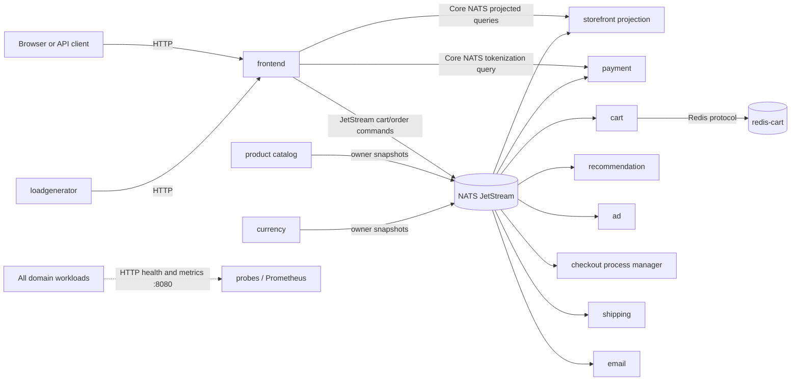
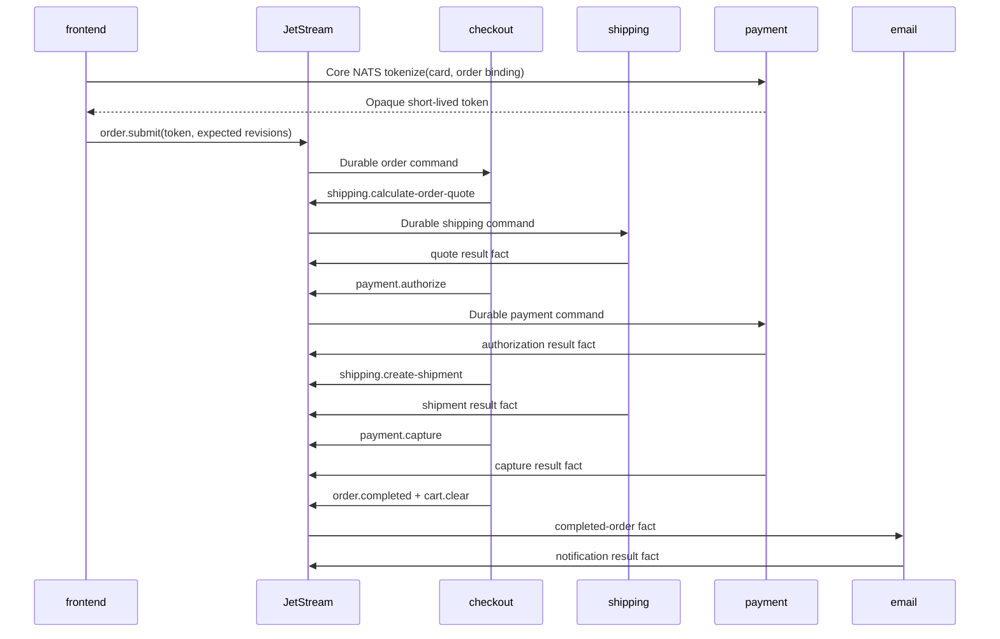

# Current service interactions

This document describes the Phase 6 NATS-only runtime produced by
[`release/kubernetes-manifests.yaml`](../release/kubernetes-manifests.yaml).
The migration history and its acceptance criteria are in
[`nats-event-driven-upgrade-plan.md`](nats-event-driven-upgrade-plan.md).

## Runtime topology

The frontend is the only application business endpoint exposed through a
Kubernetes Service. `frontend:80` and `frontend-external:80` target its HTTP
port `8080`. Redis remains private to cartservice on `6379`. Backend workloads
do not have Kubernetes Services or business-listening ports; port `8080` on
those pods exposes only `/healthz`, `/readyz`, and `/metrics`.

Every cross-domain business interaction uses NATS over authenticated TLS on
`nats.nats.svc.cluster.local:4222`. Optional OTLP telemetry can use the
collector on `4317`; that transport is observability, not a business service
contract.

Shopping Assistant and Packaging are not part of the deployed topology. Phase
6 point 1 was explicitly skipped. No address, NATS identity, permission, or KV
bucket for either optional workload is present in the release path.

## Interaction model

The architecture uses three interaction styles:

| Style | Subjects / storage | Purpose |
| --- | --- | --- |
| Durable commands | `boutique.cmd.>` in `BOUTIQUE_COMMANDS` | Cart changes and the checkout/payment/shipping workflow |
| Replayable facts | `boutique.evt.>` in `BOUTIQUE_EVENTS` | Owner snapshots, workflow results, notifications, and storefront inputs |
| Bounded queries | `boutique.qry.>` over Core NATS | Reads from the storefront projection and payment tokenization |

Commands and events use the protobuf envelope and identity conventions in
[`development/nats-message-conventions.md`](development/nats-message-conventions.md).
Durable consumers acknowledge only after their state/inbox/outbox commit. A
stable `Nats-Msg-Id` makes publish retries safe, while consumer inboxes and
provider outcome stores make delivery retries idempotent.

### Frontend reads and writes

The frontend reads views from `storefrontprojectionservice`; it does not query
domain owners directly.

| HTTP action | NATS interaction |
| --- | --- |
| Home, product, cart and currency views | `boutique.qry.storefront.home.v1`, `.product.v1`, `.cart.v1`, `.currencies.v1` |
| Product metadata and search | `boutique.qry.storefront.product-meta.v1`, `.search-products.v1` |
| Operation and order resources | `boutique.qry.storefront.operation.v1`, `.order.v1` |
| Product page context | `boutique.evt.storefront.page-viewed.v1` |
| Add/clear cart | `boutique.cmd.cart.add-item.v1`, `.clear.v1`, plus `boutique.evt.storefront.operation-accepted.v1` |
| Checkout | `boutique.qry.payment.tokenize.v1`, then `boutique.cmd.order.submit.v1` |

Cart and checkout HTTP writes require or derive an idempotency identity. They
return the same operation/order resource for a repeated identity. A write that
cannot finish inside the bounded compatibility wait is represented as `202
Accepted`; clients poll `/operations/{id}` or `/orders/{id}`.

### Domain ownership and consumers

| Workload | Durable input / query | Outputs and owned state |
| --- | --- | --- |
| `productcatalogservice` | Startup owner publication | Catalog upsert/remove/snapshot events |
| `currencyservice` | Startup owner publication | Currency rate snapshot event |
| `cartservice` | `boutique.cmd.cart.>` and catalog facts | Redis-authoritative carts; cart success/rejection facts |
| `recommendationservice` | Catalog, cart and page-view facts | Recommendation selection facts |
| `adservice` | Page-view facts | Ad selection facts |
| `checkoutservice` | Order command plus catalog/currency/cart/payment/shipping facts | Persisted saga, inbox/outbox, order lifecycle and downstream commands |
| `shippingservice` | Shipping commands and cart facts | Persisted fake-provider outcomes and shipping facts |
| `paymentservice` | Tokenization query and payment commands | Short-lived token vault, persisted provider outcomes and payment facts |
| `emailservice` | Completed-order facts | Persisted notification outcome and notification facts |
| `storefrontprojectionservice` | `boutique.evt.>` | Query endpoints and five JetStream KV materialized views |

The storefront projection stores products, carts, recent page context, orders,
and operation status in `STOREFRONT_PRODUCTS`, `STOREFRONT_CARTS`,
`STOREFRONT_CONTEXT`, `STOREFRONT_ORDERS`, and `STOREFRONT_OPERATIONS`.
These buckets are derived state and can be deleted and rebuilt by replaying
`BOUTIQUE_EVENTS`. Domain owner snapshots provide the current catalog and
currency baselines before consumers become ready.

## Checkout workflow

The checkout process manager persists each stage and deadline. Failures before
completion cancel or reject the order. Failures after authorization trigger
release/cancel compensations; a failed compensation reaches `MANUAL_REVIEW`.
Email and cart clearing remain independent from the completed-order decision.
Card PAN and CVV exist only in the frontend-to-payment tokenization request and
are not stored or published to JetStream.

## Health, observability, and isolation

All workload liveness probes call local HTTP `/healthz`. Readiness calls local
`/readyz` and reflects required NATS consumers/dependencies without publishing
a business message. Prometheus scrapes `/metrics`, including
`boutique_dependency_ready`; NATS exporter metrics cover consumer pending,
ack-pending, and redelivery counts. Alerts cover consumer lag, acknowledgement
backlog, unavailable dependencies, storage, server quorum, and max-delivery
advisories.

The default namespace has default-deny ingress and egress. Application pods can
reach DNS, NATS, optional OTLP, and only their explicit local dependency
(cartservice to Redis). Load generation can reach only frontend. The NATS
namespace accepts client traffic only from the named deployed workloads, and
each NATS identity has subject-scoped publish/subscribe grants.

## Recovery boundaries

JetStream commands, events, and DLQ streams use three replicas. The scheduled
account backup includes streams and consumers and validates the backup before
retention cleanup. [`verify-phase6-dr.sh`](../scripts/nats/verify-phase6-dr.sh)
tests both recovery paths:

- deletes all rebuildable storefront KV state and its durable consumer, then
  verifies a retained-event replay reaches zero pending/ack-pending; and
- takes a checked account backup, restores it into an isolated three-node
  JetStream cluster, and verifies all three stream inventories.

Exact operating commands and destructive-action gates are documented in
[`development/nats-phase1-runbook.md`](development/nats-phase1-runbook.md).
