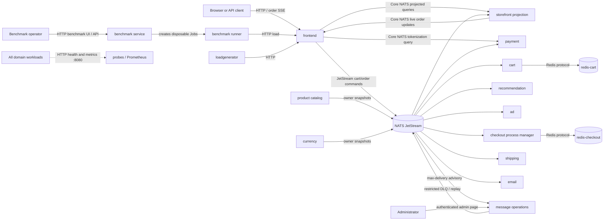
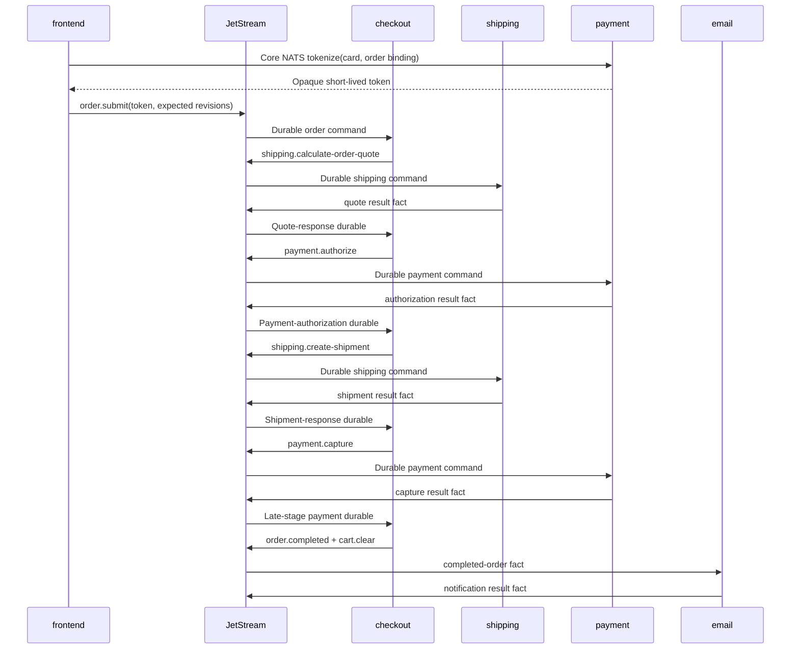

# Current service interactions

This document describes the current NATS-only runtime assembled by
[`kubernetes-manifests/kustomization.yaml`](../kubernetes-manifests/kustomization.yaml).
Published release bundles are generated from that source after application
images have been built and pinned. The migration history and its acceptance
criteria are in
[`nats-event-driven-upgrade-plan.md`](nats-event-driven-upgrade-plan.md).

## Runtime topology

```mermaid
flowchart LR
    User[Browser or API client] -->|HTTP / order SSE| FE[frontend]
    Operator[Benchmark operator] -->|HTTP benchmark UI / API| Benchmark[benchmark service]
    Benchmark -->|creates disposable Jobs| Runner[benchmark runner]
    Runner -->|HTTP load| FE
    Load[loadgenerator] -->|HTTP| FE

    FE -->|Core NATS projected queries| Projection[storefront projection]
    Projection -->|Core NATS live order updates| FE
    FE -->|JetStream cart/order commands| NATS[(NATS JetStream)]
    FE -->|Core NATS tokenization query| Payment[payment]

    Catalog[product catalog] -->|owner snapshots| NATS
    Currency[currency] -->|owner snapshots| NATS
    NATS --> Cart[cart]
    NATS --> Recommendation[recommendation]
    NATS --> Ad[ad]
    NATS --> Checkout[checkout process manager]
    NATS --> Shipping[shipping]
    NATS --> Payment
    NATS --> Email[email]
    NATS --> Projection
    NATS -->|max-delivery advisory| MessageOps[message operations]
    MessageOps -->|restricted DLQ / replay| NATS
    Admin[Administrator] -->|authenticated admin page| MessageOps
    Cart -->|Redis protocol| CartRedis[(redis-cart)]
    Checkout -->|Redis protocol| CheckoutRedis[(redis-checkout)]

    Apps[All domain workloads] -.->|HTTP health and metrics :8080| Monitor[probes / Prometheus]
```

The storefront and benchmark control plane are externally reachable through
Kubernetes Services. `frontend:80` and `frontend-external:80` target the
frontend's HTTP port `8080`; `benchmarkservice:8080` and
`benchmarkservice-external:80` target the benchmark API and UI on port `8080`.
The cart and checkout Redis services remain private to their respective owners
on `6379`. Other backend workloads
do not have Kubernetes Services or business-listening ports; port `8080` on
those pods exposes only `/healthz`, `/readyz`, and `/metrics`.

Every cross-domain business interaction uses NATS over authenticated TLS on
`nats.nats.svc.cluster.local:4222`. Optional OTLP telemetry can use the
collector on `4317`; that transport is observability, not a business service
contract.

Shopping Assistant and Packaging are not part of the deployed topology. Phase
6 point 1 was explicitly skipped. No address, NATS identity, permission, or KV
bucket for either optional workload is present in the release path.

## Interaction model

The architecture uses five interaction styles:

| Style | Subjects / storage | Purpose |
| --- | --- | --- |
| Durable commands | `boutique.cmd.>` in `BOUTIQUE_COMMANDS` | Cart changes and the checkout/payment/shipping workflow |
| Replayable facts | `boutique.evt.>` in `BOUTIQUE_EVENTS` | Owner snapshots, workflow results, notifications, and storefront inputs |
| Bounded queries | `boutique.qry.>` over Core NATS | Reads from the storefront projection and payment tokenization |
| Live notifications | `boutique.live.operation.<region-id>.<order-id>` over Core NATS | Best-effort order updates bridged only to browser SSE connections in the projector's region |
| Dead-letter operations | `BOUTIQUE_ADVISORIES`, `BOUTIQUE_DLQ`, and `DLQ_CASES` | Durable max-delivery capture, restricted payload storage, administrator review, and replay |

Commands and events use the protobuf envelope and identity conventions in
[`development/nats-message-conventions.md`](development/nats-message-conventions.md).
Durable consumers acknowledge only after their owning state/input decision is
committed and every required result publication is acknowledged. A stable
`Nats-Msg-Id` makes publish retries safe, while consumer inboxes, exact result
journals, and deterministic provider outcomes make delivery retries
idempotent.

### Frontend reads and writes

The frontend reads views from `storefrontprojectionservice`; it does not query
domain owners directly.

| HTTP action | NATS interaction |
| --- | --- |
| Home, product, cart and currency views | `boutique.qry.storefront.home.v1`, `.product.v1`, `.cart.v1`, `.currencies.v1` |
| Product metadata and search | `boutique.qry.storefront.product-meta.v1`, `.search-products.v1` |
| Operation and order resources | `boutique.qry.storefront.operation.v1`, `.order.v1` |
| Live order status | `boutique.live.operation.<region-id>.<order-id>` subscription exposed as `GET /orders/{id}/events` |
| Product page context | `boutique.evt.storefront.page-viewed.v1` |
| Add/clear cart | `boutique.cmd.cart.add-item.v1`, `.clear.v1`, plus `boutique.evt.storefront.operation-accepted.v1` |
| Checkout | `boutique.qry.payment.tokenize.v1`, then `boutique.cmd.order.submit.v1` |

Cart and checkout HTTP writes require or derive an idempotency identity. They
return the same operation/order resource for a repeated identity. A write that
cannot finish inside the bounded compatibility wait is represented as `202
Accepted`; browser order pages subscribe to `/orders/{id}/events`, while API
clients can continue polling `/operations/{id}` or `/orders/{id}`.
The SSE endpoint first returns the session-scoped authoritative order view,
then forwards named `order` events after projection updates. Core NATS delivery
is intentionally ephemeral; reconnecting obtains a fresh view rather than
replaying missed notifications.

Add-item POSTs publish directly after request validation; they do not query the
storefront for a cart version. `cartservice` validates product availability
against its shared Redis projection of replayable catalog events, deduplicates
the command ID, and retries its internal aggregate CAS when another add wins the
first commit. Clear and checkout retain observed-version preconditions because
they operate on the complete cart state.

### Domain ownership and consumers

| Workload | Durable input / query | Outputs and owned state |
| --- | --- | --- |
| `productcatalogservice` | Startup owner publication | Catalog upsert/remove/snapshot events |
| `currencyservice` | Startup owner publication | Currency rate snapshot event |
| `cartservice` | `boutique.cmd.cart.>` and catalog facts | Redis-authoritative carts; cart success/rejection facts |
| `recommendationservice` | Catalog, cart and page-view facts | Recommendation selection facts |
| `adservice` | Page-view facts | Ad selection facts |
| `checkoutservice` | Order command plus catalog/currency/cart/payment/shipping facts | Stateless workers over shared Redis saga/projection/inbox/result-journal state; order lifecycle and downstream commands |
| `shippingservice` | Shipping commands and cart facts | Deterministic fake-provider outcomes and shipping facts; no pod-owned provider state |
| `paymentservice` | Tokenization query and payment commands | Key-ID-addressed short-lived tokens, deterministic signed provider references, and payment facts |
| `emailservice` | Completed-order facts | Order/notification-keyed deterministic provider result and notification facts |
| `storefrontprojectionservice` | `boutique.evt.>` | Query endpoints, best-effort live order notifications, and five JetStream KV materialized views |
| `messageoperationsservice` | JetStream max-delivery advisories | Restricted DLQ records, case lifecycle metadata, operational events, alert metrics, and authenticated replay |

The storefront projection stores products, carts, recent page context, orders,
and operation status in `STOREFRONT_PRODUCTS_<REGION_KEY>`,
`STOREFRONT_CARTS_<REGION_KEY>`, `STOREFRONT_CONTEXT_<REGION_KEY>`,
`STOREFRONT_ORDERS_<REGION_KEY>`, and
`STOREFRONT_OPERATIONS_<REGION_KEY>`.
These buckets are derived state and can be deleted and rebuilt by replaying
`BOUTIQUE_EVENTS`. Domain owner snapshots provide the current catalog and
currency baselines before consumers become ready.

Checkout replicas compete on the same set of durable consumers and use
optimistic Redis transactions. Every transition reloads committed shared state
and atomically commits the input inbox record, saga/projection changes, and the
exact result journal.
Consequently, the pod that processes a shipping result does not need to be the
pod that processed the preceding payment or order event. Transaction conflicts
are retried, and duplicate deliveries observe the shared inbox before applying
another transition.

Shipping and payment responses are deliberately divided into early- and
late-stage durable consumers:

| Durable consumer | Filtered outcomes | Checkout responsibility |
| --- | --- | --- |
| `checkout-saga-shipping-quote-v1` | `order-quote-calculated`, `order-quote-failed` | Advance or reject `WAITING_FOR_QUOTE` orders |
| `checkout-saga-shipping-v1` | `shipment-created`, `shipment-creation-failed`, `shipment-cancelled`, `shipment-cancellation-failed` | Advance `WAITING_FOR_SHIPMENT` orders and finish shipment compensation |
| `checkout-saga-payment-authorization-v1` | `authorized`, `authorization-declined` | Advance or cancel `WAITING_FOR_AUTHORIZATION` orders |
| `checkout-saga-payment-v1` | Capture and authorization-release outcomes | Complete `WAITING_FOR_CAPTURE` orders and finish payment compensation |

Each durable has an independent pull loop and aggregate-ordered processing
pool. Quote ingress therefore cannot consume the processing slots needed by
shipment outcomes that unlock capture and completion. Authorization ingress
likewise cannot consume the slots reserved for capture outcomes, which publish
completed-order events. These separations matter under open-loop overload:
early responses arrive approximately with newly accepted orders, while later
responses represent work that has already passed preceding saga stages. A
combined queue had to process both rates; once their sum exceeded its capacity,
new early-stage traffic delayed later-stage traffic and completed-order event
throughput fell even though order acceptance remained high. That fall is
visible in the independent `boutique.evt.order.completed.v1` observer and is
distinct from the benchmark's per-order outcome timeout, which only changes how
the client classifies an unfinished submission.

The legacy `checkout-saga-shipping-v1` and `checkout-saga-payment-v1` names are
retained for shipment and late-stage payment outcomes, respectively, so their
cursors and pending late-stage work survive the cutover. On the first split
deployment, checkout creates each early-stage consumer at its legacy consumer's
acknowledged stream position before narrowing the legacy filter. The temporary
overlap is safe because the shared Redis inbox is idempotent. If no legacy
consumer exists, the new consumer uses retained-event replay instead.

### Dead-letter and replay flow

JetStream maximum-delivery advisories are retained in `BOUTIQUE_ADVISORIES`, so
a controller restart does not lose the trigger. `messageoperationsservice`
copies the exact source bytes and headers to an immutable per-case subject in
`BOUTIQUE_DLQ`, waits for the publish acknowledgement, stores safe case
metadata in `DLQ_CASES`, and emits
`boutique.evt.ops.message-dead-lettered.v1`. Work-queue commands are removed
from `BOUTIQUE_COMMANDS` only after the copy and case record are durable;
limits-retention events remain in `BOUTIQUE_EVENTS`.

The authenticated administration page shows case identity and lifecycle data,
but not the restricted payload. Replaying republishes the exact bytes to the
original subject with the original business message ID and a unique transport
replay ID. Command replay returns to the owning work queue. Event replay follows
normal subject fan-out and may therefore reach every matching durable consumer;
the existing consumer inboxes and deterministic handlers make that repeat safe.

## Checkout workflow

```mermaid
sequenceDiagram
    participant F as frontend
    participant N as JetStream
    participant C as checkout
    participant S as shipping
    participant P as payment
    participant E as email

    F->>P: Core NATS tokenize(card, order binding)
    P-->>F: Opaque short-lived token
    F->>N: order.submit(token, expected revisions)
    N->>C: Durable order command
    C->>N: shipping.calculate-order-quote
    N->>S: Durable shipping command
    S->>N: quote result fact
    N->>C: Quote-response durable
    C->>N: payment.authorize
    N->>P: Durable payment command
    P->>N: authorization result fact
    N->>C: Payment-authorization durable
    C->>N: shipping.create-shipment
    N->>S: Durable shipping command
    S->>N: shipment result fact
    N->>C: Shipment-response durable
    C->>N: payment.capture
    N->>P: Durable payment command
    P->>N: capture result fact
    N->>C: Late-stage payment durable
    C->>N: order.completed + cart.clear
    N->>E: completed-order fact
    E->>N: notification result fact
```

The checkout process manager persists each stage and deadline. Every replica
scans the 64 deadline indexes every five seconds, reducing idle Redis polling
while allowing timeout handling up to one scan interval after a deadline.
Failures before completion cancel or reject the order. Failures after
authorization trigger release/cancel compensations; a failed compensation
reaches `MANUAL_REVIEW`.
Email and cart clearing remain independent from the completed-order decision.
Card PAN and CVV exist only in the frontend-to-payment tokenization request and
are not stored or published to JetStream. Payment tokens contain only an order
binding, expiry, nonce, and HMAC; every replica derives the same verifier from
its active payment key set. Tokens and authorization references carry an
explicit key ID, and overlapping verification keys keep in-flight work stable
during rotation. Any replica can authorize, capture, release, or safely
recompute the same outcome without a local provider store. Shipping references
derive from a replica-shared provider secret and business idempotency key;
email uses order ID plus notification type. Both providers derive result time
from the input event and retain no application-local journal.

## Health, observability, and isolation

All workload liveness probes call local HTTP `/healthz`. Readiness calls local
`/readyz` and reflects required NATS consumers/dependencies without publishing
a business message. Prometheus scrapes `/metrics`, including
`boutique_dependency_ready`; NATS exporter metrics cover consumer pending,
ack-pending, and redelivery counts. Alerts cover consumer lag, acknowledgement
backlog, unavailable dependencies, storage, server quorum, dead-letter cases,
and failed DLQ transfers.

Checkout readiness requires both members of the shipping and payment splits,
and the checkout HPA lag record includes all their pending counts. For
saturation diagnosis, inspect the consumers separately: aggregate checkout lag
shows scaling pressure, while the individual early- and late-stage series show
which saga stage is falling behind.

The default namespace has default-deny ingress and egress. Application pods can
reach DNS, NATS, optional OTLP, and only their explicit local dependency
(cartservice to Redis). Load generation can reach only frontend. The NATS
namespace accepts client traffic only from the named deployed workloads, and
each NATS identity has subject-scoped publish/subscribe grants.

In supercluster mode, clients still connect only to their local
`nats.nats.svc.cluster.local:4222`. Routes stay inside one Kubernetes region;
mTLS gateways use only TCP `7222` between uniquely named NATS clusters. Global
command/event streams and the owner Redis workloads remain primary-placed,
while every region has its own projection durable and placed derived buckets.
The checked-in local inventory selects standalone mode, which exercises the
same regional application contract without requiring a remote peer.

## Recovery boundaries

JetStream command, event, DLQ, and advisory streams use three replicas. The
scheduled account backup includes streams and consumers and validates the
backup before retention cleanup.
[`verify-phase6-dr.sh`](../scripts/nats/verify-phase6-dr.sh) tests both recovery
paths:

- deletes all rebuildable storefront KV state and its durable consumer, then
  verifies a retained-event replay reaches zero pending/ack-pending; and
- takes a checked account backup, restores it into an isolated three-node
  JetStream cluster, and verifies all four stream inventories.

Exact operating commands and destructive-action gates are documented in
[`development/nats-phase1-runbook.md`](development/nats-phase1-runbook.md).
