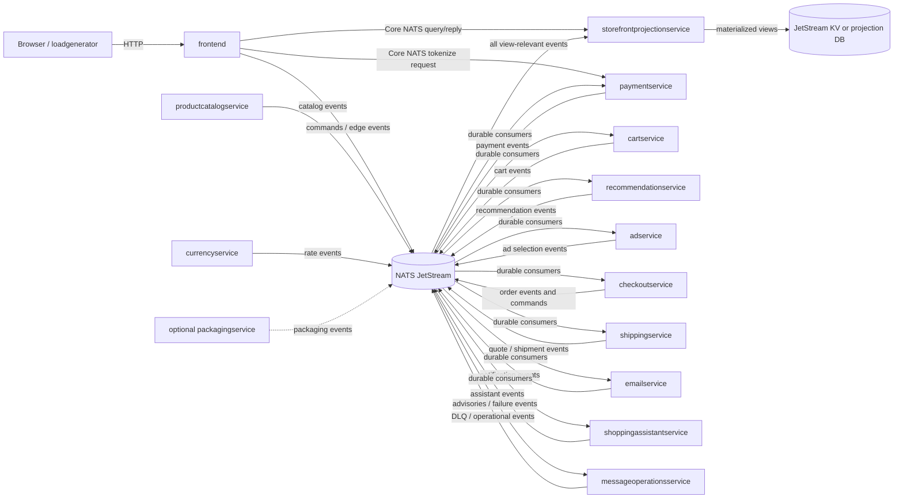
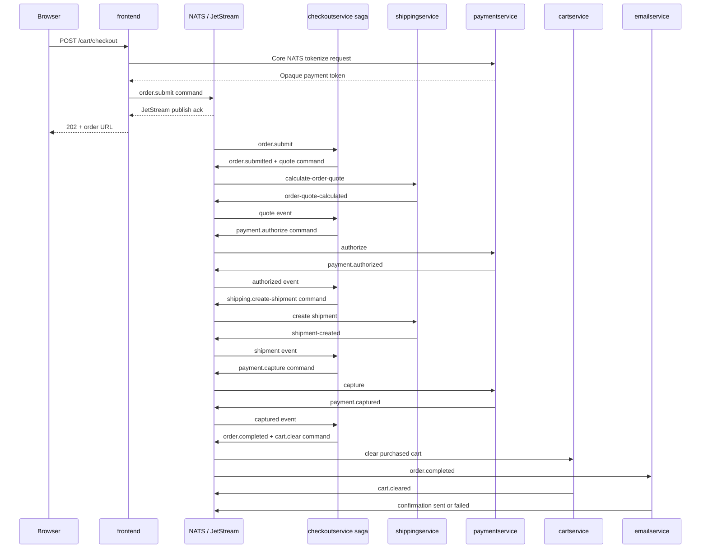

# NATS event-driven upgrade plan

This is the target design and migration plan for replacing the synchronous
service interactions in
[`current-service-interactions.md`](current-service-interactions.md) with NATS.
The frontend remains an HTTP boundary for browsers and the load generator.

## Decision summary

Use a **hybrid event-driven architecture**:

- Use **JetStream commands** for durable, asynchronous requests to change state.
- Publish **JetStream domain events** after a service has accepted a change.
- Use **NATS request/reply** for immediate, side-effect-free queries against an
  event-built read model.
- Make checkout and Shopping Assistant jobs asynchronous at the HTTP boundary:
  return `202 Accepted`, expose status resources, and optionally push status by
  Server-Sent Events (SSE).
- Keep card data out of JetStream. Tokenize it through a short-lived,
  TLS-protected request/reply call or directly with a payment provider.

Request/reply is still appropriate in some places. A browser cannot render a
product page without a current answer, and using a durable event round-trip for
every read adds latency, correlation state, and failure modes without improving
decoupling. The important change is that reads no longer synchronously fan out
to all domain services: they query one projection built from events.

## Target topology



The new `storefrontprojectionservice` is a CQRS read side. It consumes domain
events and maintains denormalized products, carts, recommendations, ads,
shipping quotes, orders, and operation statuses. The frontend makes one NATS
query/reply call to this service per HTTP page instead of calling several domain
services.

For this demo, the projection can use JetStream Key/Value buckets. A production
deployment with richer search, joins, or strict read-your-write requirements
should use a database owned by the projection service. NATS KV supports watches,
history, and compare-and-set, but direct reads do not guarantee read-your-writes
in every clustered configuration.

Domain-owner stores remain authoritative; `BOUTIQUE_EVENTS` is the durable
integration log, not a substitute for order, cart, payment, or shipment state.
Owners must be able to republish versioned snapshots so a projection can recover
even after older integration events have expired.

## Messaging rules

### Subject convention

Use stable, low-cardinality subjects:

```text
boutique.cmd.<domain>.<imperative-command>.v1
boutique.evt.<domain>.<past-tense-fact>.v1
boutique.qry.<view>.<query>.v1
boutique.live.operation.<operation-id>
boutique.dlq.<original-domain>.<message-type>.v1
```

Examples:

```text
boutique.cmd.cart.add-item.v1
boutique.evt.cart.item-added.v1
boutique.qry.storefront.cart.v1
```

IDs normally belong in the payload, not the subject. The operation ID is only
used in the optional ephemeral `boutique.live.*` namespace for active SSE
connections.

### Common envelope

Every command and event must use a versioned protobuf schema and carry:

| Field | Purpose |
| --- | --- |
| `message_id` | Globally unique ID; also sent as the `Nats-Msg-Id` header |
| `message_type` | Stable semantic type, such as `boutique.cart.ItemAdded.v1` |
| `schema_version` | Payload schema version |
| `occurred_at` | UTC timestamp assigned by the publisher |
| `producer` | Publishing service and version |
| `aggregate_type`, `aggregate_id` | Entity whose state changed |
| `aggregate_version` | Monotonic version used to reject stale/out-of-order updates |
| `correlation_id` | HTTP operation ID or order ID spanning the workflow |
| `causation_id` | Message that directly caused this message |
| `traceparent`, `tracestate` | OpenTelemetry propagation |
| `data` | Versioned protobuf payload |

Breaking schema changes receive a new `.v2` subject. Additive protobuf changes
stay on the existing subject. Keep schemas under `protos/events/v1` and
`protos/commands/v1`, generate all language bindings in CI, and run compatibility
tests before deployment.

### Streams and stores

| Asset | Subjects / keys | Retention | Recommended configuration |
| --- | --- | --- | --- |
| `BOUTIQUE_COMMANDS` | `boutique.cmd.>` | `WorkQueuePolicy` | File storage, 3 replicas, explicit ack, `DiscardNew`, maximum age longer than the longest tolerated outage |
| `BOUTIQUE_EVENTS` | `boutique.evt.>` | `LimitsPolicy` | File storage, 3 replicas, explicit-ack durable consumers, retention long enough to rebuild projections |
| `BOUTIQUE_DLQ` | `boutique.dlq.>` | `LimitsPolicy` | File storage, 3 replicas, long retention and alerting |
| `STOREFRONT_PRODUCTS` | Product ID | KV history 1+ | Product view and catalog revision |
| `STOREFRONT_CARTS` | User/session ID | KV history 2+ | Full cart snapshot and cart version |
| `STOREFRONT_CONTEXT` | User/session ID | KV with short TTL | Latest recommendations, ads, and cart quote |
| `STOREFRONT_ORDERS` | Order ID | KV history | Sanitized order and workflow status |
| `STOREFRONT_OPERATIONS` | Operation ID | KV with TTL | State of asynchronous HTTP commands |
| `STOREFRONT_ASSISTANT` | Assistant operation ID | KV with TTL | Generated response or failure |

Do not store query subjects in a stream. Core NATS request/reply is intentionally
ephemeral. Do not put images in messages; pass an object-store reference. Most
NATS deployments default to a 1 MiB maximum payload, and event payloads should
remain much smaller.

## Command catalog

Commands express an intent and have exactly one logical handling service. The
handler may have multiple replicas sharing one durable pull consumer.

| Subject | Publisher | Subscriber | Required data and result event |
| --- | --- | --- | --- |
| `boutique.cmd.cart.add-item.v1` | `frontend` | `cartservice` | `command_id`, user ID, product ID, quantity, expected cart version → `cart.item-added` or `cart.command-rejected` |
| `boutique.cmd.cart.clear.v1` | `frontend` or `checkoutservice` | `cartservice` | `command_id`, user ID, expected version, reason, optional order ID → `cart.cleared` or `cart.command-rejected` |
| `boutique.cmd.order.submit.v1` | `frontend` | `checkoutservice` | Operation/order ID, user ID, expected cart/catalog/rate versions, currency, address, email, payment token → an `order.*` lifecycle event |
| `boutique.cmd.shipping.calculate-order-quote.v1` | `checkoutservice` | `shippingservice` | Order ID, address, immutable cart snapshot → `shipping.order-quote-calculated` or `shipping.order-quote-failed` |
| `boutique.cmd.payment.authorize.v1` | `checkoutservice` | `paymentservice` | Order ID, amount, currency, payment token, idempotency key → `payment.authorized` or `payment.authorization-declined` |
| `boutique.cmd.shipping.create-shipment.v1` | `checkoutservice` | `shippingservice` | Order ID, address, immutable items, idempotency key → `shipping.shipment-created` or `shipping.shipment-creation-failed` |
| `boutique.cmd.payment.capture.v1` | `checkoutservice` | `paymentservice` | Order ID, authorization ID, amount, idempotency key → `payment.captured` or `payment.capture-failed` |
| `boutique.cmd.payment.release-authorization.v1` | `checkoutservice` | `paymentservice` | Order ID, authorization ID, reason, idempotency key → `payment.authorization-released` or `payment.authorization-release-failed` |
| `boutique.cmd.shipping.cancel-shipment.v1` | `checkoutservice` | `shippingservice` | Order ID, shipment/tracking ID, reason, idempotency key → `shipping.shipment-cancelled` or `shipping.shipment-cancellation-failed` |
| `boutique.cmd.assistant.generate-response.v1` | `frontend` | `shoppingassistantservice` | Operation ID, session ID, prompt, image object reference → `assistant.response-generated` or `assistant.response-failed` |

The order command must not contain a card number or CVV. It carries only an
opaque payment token. Commands are acknowledged only after the subscriber has
durably recorded its state change and corresponding outbox result.

For every HTTP command, the frontend publishes
`storefront.operation-accepted` only after the command's JetStream publish ack.
If the second publish fails, it returns a retryable error and reuses the same
command and operation IDs on retry. Result events also carry those IDs, so the
projection can reconstruct a missing queued status without repeating the domain
change.

## Domain event catalog

All business events proposed for the target behavior are listed below. A
subscriber name means a separate durable consumer unless the event is explicitly
described as best-effort.

### Catalog, currency, and storefront context

| Subject | Publisher | Subscribers | Minimum event data |
| --- | --- | --- | --- |
| `boutique.evt.catalog.product-upserted.v1` | `productcatalogservice` | `storefrontprojectionservice`, `recommendationservice`, `cartservice`, `checkoutservice` | Full product, product version, catalog revision |
| `boutique.evt.catalog.product-removed.v1` | `productcatalogservice` | `storefrontprojectionservice`, `recommendationservice`, `cartservice`, `checkoutservice` | Product ID, product version, catalog revision |
| `boutique.evt.catalog.snapshot-completed.v1` | `productcatalogservice` | `storefrontprojectionservice`, `recommendationservice`, `cartservice`, `checkoutservice`, `messageoperationsservice` | Catalog revision, product count, checksum |
| `boutique.evt.packaging.product-info-upserted.v1` | Optional `packagingservice` | `storefrontprojectionservice` | Product ID, weight, dimensions, packaging revision |
| `boutique.evt.packaging.product-info-removed.v1` | Optional `packagingservice` | `storefrontprojectionservice` | Product ID, packaging revision |
| `boutique.evt.packaging.snapshot-completed.v1` | Optional `packagingservice` | `storefrontprojectionservice`, `messageoperationsservice` | Packaging revision, product count, checksum |
| `boutique.evt.currency.rates-updated.v1` | `currencyservice` | `storefrontprojectionservice`, `checkoutservice` | Base currency, complete supported rates, effective time, rate revision |
| `boutique.evt.storefront.page-viewed.v1` | `frontend` | `recommendationservice`, `adservice` | Session ID, page type, optional product/category IDs, current cart version; no address or card data |
| `boutique.evt.storefront.operation-accepted.v1` | `frontend` | `storefrontprojectionservice` | Operation/command ID, operation kind, queued status, user/session ID, acceptance time |

`productcatalogservice` bootstraps the current JSON catalog as versioned product
events. `currencyservice` publishes a complete rate snapshot. Conversion itself
is deterministic calculation and is not an event: checkout and the read model
calculate from their local rate projection.

### Cart, recommendations, ads, and cart-page shipping

| Subject | Publisher | Subscribers | Minimum event data |
| --- | --- | --- | --- |
| `boutique.evt.cart.item-added.v1` | `cartservice` | `storefrontprojectionservice`, `checkoutservice`, `recommendationservice`, `shippingservice` | User ID, product ID, delta, resulting quantity, full cart snapshot, cart version, command ID |
| `boutique.evt.cart.cleared.v1` | `cartservice` | `storefrontprojectionservice`, `checkoutservice`, `recommendationservice`, `shippingservice` | User ID, prior item IDs, empty cart snapshot, cart version, reason, optional order ID, command ID |
| `boutique.evt.cart.command-rejected.v1` | `cartservice` | `storefrontprojectionservice`, `checkoutservice` when order-correlated, `messageoperationsservice` | Command ID, user ID, safe reason code, current cart version |
| `boutique.evt.recommendation.generated.v1` | `recommendationservice` | `storefrontprojectionservice` | Session ID, triggering context/version, ordered product IDs, expiry |
| `boutique.evt.recommendation.generation-failed.v1` | `recommendationservice` | `storefrontprojectionservice`, `messageoperationsservice` | Session ID, correlation ID, safe reason code |
| `boutique.evt.ad.selection-generated.v1` | `adservice` | `storefrontprojectionservice` | Session ID, triggering page context, selected ads, expiry |
| `boutique.evt.ad.selection-failed.v1` | `adservice` | `messageoperationsservice` | Session ID, correlation ID, safe reason code |
| `boutique.evt.shipping.cart-quote-updated.v1` | `shippingservice` | `storefrontprojectionservice` | User ID, cart version, USD quote, expiry |
| `boutique.evt.shipping.cart-quote-failed.v1` | `shippingservice` | `storefrontprojectionservice`, `messageoperationsservice` | User ID, cart version, safe reason code |

Recommendation and ad generation become reactive. A page view or cart event
triggers fresh content, which appears through the projection when ready. A page
may initially render the previous recommendation/ad or omit non-critical
content; SSE can update it later. Shipping can precompute the current cart quote
because the existing quote calculation depends only on the cart items.

### Order, shipping, and payment workflow

| Subject | Publisher | Subscribers | Minimum event data |
| --- | --- | --- | --- |
| `boutique.evt.order.submitted.v1` | `checkoutservice` | `storefrontprojectionservice` | Order/operation ID, user ID, sanitized immutable order snapshot, accepted revisions |
| `boutique.evt.order.processing-stage-changed.v1` | `checkoutservice` | `storefrontprojectionservice` | Order ID, stage enum, timestamp; no payment token |
| `boutique.evt.order.rejected.v1` | `checkoutservice` | `storefrontprojectionservice` | Order/operation ID, safe validation reason |
| `boutique.evt.order.completed.v1` | `checkoutservice` | `storefrontprojectionservice`, `emailservice` | Order result, amount, currency, recipient email, shipping address, tracking ID, items; no payment token/provider secrets |
| `boutique.evt.order.cancelled.v1` | `checkoutservice` | `storefrontprojectionservice` | Order ID, safe reason, completed compensations |
| `boutique.evt.order.manual-review-required.v1` | `checkoutservice` | `storefrontprojectionservice`, `messageoperationsservice` | Order ID, failed step/compensation, restricted provider references |
| `boutique.evt.order.step-timed-out.v1` | `checkoutservice` | `storefrontprojectionservice`, `messageoperationsservice` | Order ID, waiting stage, deadline, last command ID, chosen retry/compensation action |
| `boutique.evt.shipping.order-quote-calculated.v1` | `shippingservice` | `checkoutservice` | Order ID, USD shipping cost, quote ID, expiry |
| `boutique.evt.shipping.order-quote-failed.v1` | `shippingservice` | `checkoutservice` | Order ID, safe reason, retryability |
| `boutique.evt.shipping.shipment-created.v1` | `shippingservice` | `checkoutservice` | Order ID, shipment ID, tracking ID |
| `boutique.evt.shipping.shipment-creation-failed.v1` | `shippingservice` | `checkoutservice` | Order ID, safe reason, retryability |
| `boutique.evt.shipping.shipment-cancelled.v1` | `shippingservice` | `checkoutservice` | Order ID, shipment ID |
| `boutique.evt.shipping.shipment-cancellation-failed.v1` | `shippingservice` | `checkoutservice`, `messageoperationsservice` | Order ID, shipment ID, safe reason |
| `boutique.evt.payment.authorized.v1` | `paymentservice` | `checkoutservice` | Order ID, authorization ID, amount, currency; no card or token |
| `boutique.evt.payment.authorization-declined.v1` | `paymentservice` | `checkoutservice` | Order ID, safe decline category; never raw provider/card data |
| `boutique.evt.payment.captured.v1` | `paymentservice` | `checkoutservice` | Order ID, transaction ID, amount, currency |
| `boutique.evt.payment.capture-failed.v1` | `paymentservice` | `checkoutservice` | Order ID, authorization ID, safe reason, retryability |
| `boutique.evt.payment.authorization-released.v1` | `paymentservice` | `checkoutservice` | Order ID, authorization ID |
| `boutique.evt.payment.authorization-release-failed.v1` | `paymentservice` | `checkoutservice`, `messageoperationsservice` | Order ID, authorization ID, safe reason |

The target separates authorization from capture. This avoids the current
charge-then-ship failure window. If the demo must initially preserve the single
mock `Charge` operation, use `payment.charge-requested`, `payment.charged`, and
`payment.charge-failed`, plus a compensating refund command/event, then migrate
to authorize/capture before connecting a real provider.

### Notifications, assistant, and operations

| Subject | Publisher | Subscribers | Minimum event data |
| --- | --- | --- | --- |
| `boutique.evt.notification.order-confirmation-sent.v1` | `emailservice` | `storefrontprojectionservice`, `messageoperationsservice` | Order ID, recipient hash or masked address, provider message ID |
| `boutique.evt.notification.order-confirmation-failed.v1` | `emailservice` | `storefrontprojectionservice`, `messageoperationsservice` | Order ID, safe reason, attempt count, retryability |
| `boutique.evt.assistant.response-generated.v1` | `shoppingassistantservice` | `storefrontprojectionservice` | Operation ID, generated text, referenced product IDs |
| `boutique.evt.assistant.response-failed.v1` | `shoppingassistantservice` | `storefrontprojectionservice`, `messageoperationsservice` | Operation ID, safe reason, retryability |
| `boutique.evt.ops.message-dead-lettered.v1` | `messageoperationsservice` | Alert manager and restricted audit sink | Original stream/subject/sequence, consumer, attempts, error category, correlation ID; payload omitted or access-restricted |

`emailservice` subscribes directly to `order.completed`; checkout does not wait
for email. Failed notification events are retried independently and never roll
back an order. A transient send failure is negatively acknowledged for
redelivery; the terminal failure event is emitted only when the policy is
exhausted or the error is non-retryable.

## Query/reply catalog

These Core NATS endpoints are not persisted. Run responders in queue groups,
set short deadlines, handle `no responders`, and return explicit not-found,
stale, and unavailable results.

| Subject | Requester | Responder | Purpose |
| --- | --- | --- | --- |
| `boutique.qry.storefront.home.v1` | `frontend` | `storefrontprojectionservice` | Products, supported currencies, cart summary, latest ad |
| `boutique.qry.storefront.product.v1` | `frontend` | `storefrontprojectionservice` | Product, localized price, cart summary, latest recommendations/ad |
| `boutique.qry.storefront.cart.v1` | `frontend` | `storefrontprojectionservice` | Cart items, localized prices, quote, recommendations, projection versions |
| `boutique.qry.storefront.currencies.v1` | `frontend` | `storefrontprojectionservice` | Supported currency codes for the Assistant page or other lightweight views |
| `boutique.qry.storefront.product-meta.v1` | `frontend` | `storefrontprojectionservice` | Existing `/product-meta/{ids}` behavior |
| `boutique.qry.storefront.search-products.v1` | `frontend` or admin tooling if retained | `storefrontprojectionservice` | Preserve the currently exposed but unused product search contract |
| `boutique.qry.storefront.order.v1` | `frontend` | `storefrontprojectionservice` | Sanitized order and workflow status by order ID |
| `boutique.qry.storefront.operation.v1` | `frontend` | `storefrontprojectionservice` | Cart/assistant command status by operation ID |
| `boutique.qry.payment.tokenize.v1` | `frontend` | `paymentservice` | Exchange card fields for a short-lived opaque token without persisting the request in JetStream |

An optional `boutique.qry.recommendation.for-context.v1` endpoint can provide a
cold-start fallback when no generated recommendation exists. It should remain
non-critical and retain the current short timeout behavior.

Implement responders with the NATS service framework so endpoint discovery,
request counts, errors, and latency are available through service `PING`,
`INFO`, and `STATS`. Query responses should include projection revision and
`updated_at`, allowing the frontend to distinguish not-found from stale data.
Core NATS does not persist a request: callers must use bounded timeouts, map
`no responders` to HTTP `503`, and only retry idempotent queries. Payment
tokenization retries require their own idempotency key.

## Replacement of every current service interaction

| Current interaction | NATS target |
| --- | --- |
| Product `ListProducts`, `GetProduct`, `SearchProducts` | Catalog owner publishes product events; the storefront projection serves list/get/search queries without calling the catalog service |
| Currency `GetSupportedCurrencies`, `Convert` | Currency owner publishes complete rate snapshots; the projection and checkout calculate conversions locally from a versioned rate set |
| Cart `GetCart` | Storefront cart query reads the `cart.*` event projection |
| Cart `AddItem`, `EmptyCart` | Durable cart commands produce `cart.item-added`, `cart.cleared`, or rejection events |
| Recommendation `ListRecommendations` | Recommendation reacts to catalog/cart/page-view events and publishes a session-scoped result; optional request/reply is only a cold-start fallback |
| Ad `GetAds` | Ad service reacts to page-view context and publishes an expiring selection; pages tolerate a missing/previous ad |
| Shipping `GetQuote` on cart page | Shipping reacts to cart events and precomputes a versioned cart quote |
| Shipping `GetQuote` during checkout | Checkout emits a quote command and advances only after the correlated quote event |
| Shipping `ShipOrder` | Checkout emits a create-shipment command; shipping publishes success/failure and supports a cancellation compensation |
| Payment `Charge` | Payment tokenization stays ephemeral; the durable saga uses authorize/capture commands and events with idempotency |
| Email `SendOrderConfirmation` | Email subscribes to `order.completed` and publishes notification outcome events |
| Checkout `PlaceOrder` | Frontend publishes `order.submit`; checkout persists and drives the event-based saga; HTTP clients observe the order projection |
| Recommendation → Product `ListProducts` | Recommendation maintains its own catalog projection from product events |
| Checkout → Cart/Product/Currency | Checkout maintains cart, product-price, and currency-rate projections from events |
| Cart → Redis | Remains an internal persistence interaction, upgraded with persistence, versions, inbox, and transactional outbox |
| Optional frontend → Packaging HTTP | Packaging owner publishes product-packaging events; the product view reads packaging data from the storefront projection |
| Frontend → Shopping Assistant HTTP | Async assistant command plus result/failure event and an HTTP operation resource |
| Frontend → Google metadata discovery | Remains an infrastructure concern or is replaced by Kubernetes environment/Downward API configuration; no business event |
| Kubernetes probes | Remain local control-plane checks; do not turn probes into business messages |

## HTTP behavior at the frontend

The frontend remains the only application entry point exposed outside the
cluster. It translates HTTP into NATS queries or commands and maps domain status
back to HTTP.

| HTTP route | Target behavior |
| --- | --- |
| `GET`/`HEAD /` | Query `storefront.home`; publish `storefront.page-viewed` after serving |
| `GET`/`HEAD /product/{id}` | Query `storefront.product`; publish a product page-view event |
| `GET`/`HEAD /cart` | Query `storefront.cart`; no fan-out to cart, catalog, currency, shipping, or recommendation services |
| `POST /cart` | Publish durable `cart.add-item`; return `202` with `Location: /operations/{command_id}` or use the compatibility wait below |
| `POST /cart/empty` | Publish durable `cart.clear`; return `202` and an operation URL |
| `POST /cart/checkout` | Tokenize card, publish durable `order.submit`, return `202` with `Location: /orders/{order_id}` |
| `GET /assistant` | Query `storefront.currencies`, then render the existing page |
| `GET /orders/{order_id}` | Query `storefront.order`; return `200` with the known processing/terminal status, `404` if unknown, or `503` if the projection query is unavailable |
| `GET /operations/{operation_id}` | Query `storefront.operation`; return queued/processing/succeeded/failed |
| `GET /operations/{operation_id}/events` | Optional SSE stream of sanitized status changes |
| `POST /bot` | Store image externally, publish `assistant.generate-response`, return `202` and an operation URL |
| `GET /product-meta/{ids}` | Query `storefront.product-meta` |
| `POST /setCurrency`, `GET /logout`, `/static/*`, `/robots.txt`, `/_healthz` | Remain local HTTP/cookie/control-plane operations; no NATS business message |

### Preserving the current browser experience

The existing HTML forms expect redirects rather than `202` JSON. During
migration, the frontend can use a bounded compatibility wait:

1. Publish the JetStream command and receive the server's persistence ack.
2. Publish `storefront.operation-accepted` with the same IDs and wait for its
   persistence ack.
3. Wait up to a small limit for the correlated operation projection to become
   `succeeded` or `failed`.
4. If it succeeds, return the existing `303` redirect.
5. If it is still pending, return a `202` progress page that polls the operation
   URL or listens with SSE.

This does not make the downstream workflow request/reply: the frontend is
waiting on an event-derived status and has a correct asynchronous fallback.
JavaScript clients can use the `202` path immediately.

For checkout, do not hold the HTTP request open for the entire saga. The browser
should receive an order ID promptly and observe progress. The load generator
must be updated to follow `202`, poll until a terminal state, and reuse an
`Idempotency-Key` when retrying.

For optional SSE, `storefrontprojectionservice` publishes a sanitized Core NATS
notification on `boutique.live.operation.<operation-id>` after updating the
authoritative operation projection. Only the frontend instance holding that SSE
connection subscribes. Core delivery is best-effort, so reconnecting clients
always resume by querying the operation resource rather than relying on missed
notifications.

## Checkout saga

`checkoutservice` becomes a durable saga/process manager. It persists the order,
current state, processed message IDs, and pending outbox messages. It subscribes
to cart, catalog, and currency events so order preparation needs no synchronous
service calls.



Failure/compensation rules:

- Invalid versions, missing products, invalid currency, or an empty cart produce
  `order.rejected` before payment.
- Quote failure is retried according to policy, then cancels the order.
- Every waiting saga state has a persisted deadline. The checkout deadline
  scanner emits `order.step-timed-out` and performs the documented retry or
  compensation instead of leaving an order pending forever.
- Payment decline cancels the order without creating a shipment.
- Shipment creation failure after authorization issues
  `payment.release-authorization`.
- Capture failure after shipment creation issues both shipment cancellation and
  authorization release.
- A failed compensation produces `order.manual-review-required`; never report
  the order as simply failed when money or shipment state is uncertain.
- After successful capture and shipment, cart clearing and confirmation are
  independent, retryable side effects. Their failure does not reverse the order.
- Every provider call uses the order/command ID as its provider idempotency key.

## Delivery, ordering, and consistency

JetStream consumers are at-least-once by default, so duplicate delivery is an
expected operating condition:

- Publish with a stable `Nats-Msg-Id` and wait for the JetStream publish ack.
- Use durable pull consumers with explicit acknowledgements. Ack only after the
  state change and outgoing message are durable.
- Store an inbox record keyed by `message_id`; returning the previous outcome is
  safer than re-running a side effect.
- Use a transactional outbox for service databases. For the existing Redis cart,
  write the cart, aggregate version, inbox record, and outbox record in one Redis
  transaction, then relay the outbox to JetStream.
- Make payment, shipping, email, and assistant handlers idempotent using
  `command_id`/`order_id`.
- Use `aggregate_version` and compare-and-set in projections so a delayed event
  cannot overwrite newer state.
- Serialize commands for the same cart/order. Start with one logical worker for
  the demo; for scale, put a stable hash partition in command subjects and
  assign each partition to one ordered worker, or enforce optimistic concurrency
  in the owner store.
- Configure `AckWait`, backoff, `MaxDeliver`, and in-progress acknowledgements per
  handler latency. A dead-letter controller handles max-delivery advisories,
  republishes a restricted diagnostic message to `BOUTIQUE_DLQ`, waits for its
  publish ack, explicitly removes the original work-queue message, and alerts.

`messageoperationsservice` subscribes to
`$JS.EVENT.ADVISORY.CONSUMER.MAX_DELIVERIES.>` and uses the advisory's stream
sequence to retrieve the original message. NATS leaves a max-delivery message in
its stream until it is explicitly deleted or acknowledged, which is why the DLQ
copy and removal must be an observed, recoverable procedure.

JetStream deduplication and double acknowledgements reduce transport duplicates,
but they cannot make an external payment or carrier side effect atomic with a
message acknowledgement. Business-level idempotency remains mandatory.

## Security and privacy

- Enable TLS for every NATS connection and encryption at rest for JetStream.
- Terminate HTTPS at the external edge; never send checkout/card forms over
  plain HTTP in a production deployment.
- Give each workload separate NATS credentials. Allow it to publish and
  subscribe only to the subjects in the command/event tables.
- Allow the frontend to publish commands and page-view events and to request
  storefront queries; it must not subscribe to raw payment subjects.
- Restrict payment subjects to `checkoutservice` and `paymentservice`.
- Never place PAN, CVV, raw provider errors, assistant images, or credentials in
  JetStream, logs, dead-letter payloads, or trace attributes.
- Tokenize before `order.submit`; make tokens short-lived, order-bound, and
  unusable by other NATS identities.
- `paymentservice` or the external provider owns the token vault. Expire or
  consume the token after capture/cancellation and never persist raw card data
  as the token's application-side value.
- Minimize PII in order events. Use separate restricted streams/accounts if
  address-bearing events require different retention or consumer access.
- Redact or hash email addresses in notification status events.
- Apply Kubernetes NetworkPolicies so applications reach NATS but do not retain
  direct access to old gRPC ports after cutover.

NATS supports TLS, account isolation, and subject-level publish/subscribe
permissions. Use these controls even inside the Kubernetes cluster.

## Service-by-service end state

| Service | Publishes | Subscribes / serves |
| --- | --- | --- |
| `frontend` | Cart/order/assistant commands; page-view events | HTTP externally; storefront queries and payment tokenization internally; optional live status subjects |
| `storefrontprojectionservice` | Optional sanitized Core live-status notifications | All view-relevant events; serves all `boutique.qry.storefront.*` endpoints |
| `productcatalogservice` | Product upsert/remove/snapshot events | Its local file/admin source; no per-page query traffic |
| `currencyservice` | Rate snapshot events | Its local rate source; no per-price conversion traffic |
| `cartservice` | Cart success/rejection events | Cart commands and catalog events; owns Redis cart state |
| `recommendationservice` | Recommendation generated/failed events | Catalog, cart, and page-view events |
| `adservice` | Ad selection generated/failed events | Page-view events |
| `shippingservice` | Cart/order quote and shipment events | Cart events and shipping commands |
| `checkoutservice` | Order lifecycle events and saga commands | Order commands plus catalog, currency, cart, shipping, and payment events |
| `paymentservice` | Payment events | Tokenization request/reply and payment commands |
| `emailservice` | Confirmation status events | `order.completed` events |
| `shoppingassistantservice` | Assistant result events | Assistant commands; external Gemini/AlloyDB dependencies remain private to it |
| Optional `packagingservice` | Packaging upsert/remove/snapshot events | Its packaging source; no product-page HTTP call |
| `messageoperationsservice` | Dead-lettered operational events | JetStream max-delivery advisories and failure/health events; manages restricted DLQ and alerts |
| `loadgenerator` | None directly | HTTP only; follows async operation/order status |

## Phased migration

### Phase 0: contracts and architecture guardrails

1. Add an ADR recording the hybrid decision, ownership boundaries, delivery
   semantics, and card-tokenization rule.
2. Add versioned command/event protobufs and golden compatibility tests in every
   language.
3. Define correlation, causation, idempotency, error, and trace conventions.
4. Record baseline HTTP responses and current gRPC traffic for parity testing.

Exit criterion: every current interaction maps to a target command, event,
projection query, or explicitly retained local HTTP behavior.

### Phase 1: NATS platform

1. Deploy a NATS cluster with JetStream and persistent volumes.
2. Create streams, KV buckets, limits, backups, credentials, TLS, permissions,
   dashboards, and max-delivery alerting declaratively.
3. Add a shared NATS configuration contract to each language client: reconnect,
   drain, publish timeout, tracing, headers, and health reporting.
4. Make readiness mean both application readiness and required NATS
   subscriptions/consumers being established.

Exit criterion: node loss does not lose acknowledged test events, consumers can
replay, and unauthorized subjects are denied.

The Pod/member-loss, replay, and authorization checks pass. Physical worker
loss remains pending until the cluster has at least three schedulable workers
and independent durable storage; three members co-located on one host cannot
survive loss of that host.

### Phase 2: publish facts without changing traffic

1. Product catalog publishes deterministic bootstrap product/snapshot events.
2. Currency publishes a versioned rate snapshot.
3. Add outbox/inbox support and event publication to cart while gRPC remains the
   write API.
4. Replace Redis `emptyDir` with a persistent/managed configuration.
5. Build `storefrontprojectionservice`, replay it from an empty state, and compare
   its views with current gRPC-composed pages.

Exit criterion: shadow projections match catalog, currencies, carts, and prices
without serving user traffic.

The clean empty-state replay matched all nine products, all 33 currencies, 297
computed prices, and versioned cart mutations while the frontend remained on
its existing gRPC path.

### Phase 3: migrate frontend reads

1. Move home, product, cart, and product-meta handlers one at a time to
   `boutique.qry.storefront.*`.
2. Publish page-view events and migrate recommendation/ad generation to events.
3. Make shipping consume cart events and publish cart quote projections.
4. Remove the frontend's direct catalog, currency, recommendation, ad, and
   cart-page shipping clients after parity and latency tests pass.

Exit criterion: GET/HEAD routes make one read-model query and no domain-service
fan-out; stale/non-critical content degrades as specified.

The live outage check returned HTTP 200 for every migrated GET/HEAD route in
1.9-20.6 ms while catalog, currency, recommendation, ad, and shipping were all
scaled to zero, then restored every Deployment to 1/1 ready.

### Phase 4: migrate cart commands

1. Implement durable `cart.add-item` and `cart.clear` consumers with optimistic
   cart versions and idempotency.
2. Add HTTP operation resources and the bounded redirect compatibility wait.
3. Update the load generator and integration tests for both immediate redirects
   and `202` fallback.
4. Disable the frontend-to-cart gRPC path.

Exit criterion: retries of one HTTP idempotency key change the cart once, and a
cart worker outage queues commands without losing them.

The authorized live outage check returned `202` for both queued commands. After
the cart worker was restored, the first command reached `SUCCEEDED`, the stale
second command reached `REJECTED`, and the projected cart contained exactly one
mutation.

### Phase 5: migrate checkout to a saga

1. Add durable order/saga storage to `checkoutservice`.
2. Introduce payment tokenization; remove card data from checkout messages and
   payment logs.
3. Implement quote, authorize, shipment, capture, and compensation
   commands/events in shadow mode with fake providers.
4. Switch `POST /cart/checkout` to `202` plus order status and optional SSE.
5. Make email consume `order.completed`; make cart clearing an independent
   idempotent command.
6. Run failure-injection tests at every step and verify compensation/manual
   review outcomes.

Exit criterion: no checkout gRPC calls remain, duplicate/redelivered messages do
not duplicate money or shipment side effects, and every order reaches a terminal
or manual-review state.

### Phase 6: optional assistant and cleanup

1. Remove obsolete gRPC addresses, clients, ports, probes, and protobuf services
   only after the rollback window closes.
2. Replace gRPC health checks with local HTTP health plus NATS consumer-lag and
   dependency metrics; do not make a probe publish business messages.
3. Tighten NetworkPolicies and subject permissions, and update architecture,
   runbooks, load tests, and disaster-recovery exercises.

Exit criterion: the release manifest has no unresolved service address, all
business writes and workflows use the documented NATS contracts, and projection
rebuild/stream restore is tested.

## Acceptance tests for the final architecture

- Replaying retained `BOUTIQUE_EVENTS` plus current owner snapshots rebuilds
  every storefront view to the same logical state.
- Publishing the same command/message ID repeatedly produces one state change
  and the same outcome.
- Restarting a consumer after processing but before ack does not repeat an
  external side effect.
- A NATS node or service outage yields queued work or a bounded query error, not
  silent message loss.
- Old and new event schema versions coexist during rolling deployments.
- Cart commands for the same user cannot overwrite a newer cart version.
- Checkout tests cover decline, quote failure, shipment failure, capture
  failure, compensation failure, notification failure, and cart-clear failure.
- No card number/CVV appears in streams, KV, logs, traces, DLQ, or order events.
- Frontend GET routes have bounded query timeouts and useful stale/unavailable
  responses; write routes expose durable operation IDs.
- Consumer lag, redeliveries, max-delivery advisories, DLQ depth, saga age, and
  projection age are observable and alerted.

## NATS references

- [Core NATS request/reply](https://docs.nats.io/nats-concepts/core-nats/reqreply)
- [JetStream streams and retention](https://docs.nats.io/nats-concepts/jetstream/streams)
- [JetStream consumers and acknowledgement behavior](https://docs.nats.io/nats-concepts/jetstream/consumers)
- [JetStream monitoring and advisory subjects](https://docs.nats.io/running-a-nats-service/nats_admin/monitoring/monitoring_jetstream)
- [When to use Core NATS versus JetStream](https://docs.nats.io/using-nats/developer/develop_jetstream)
- [JetStream Key/Value store](https://docs.nats.io/nats-concepts/jetstream/key-value-store)
- [NATS service framework](https://docs.nats.io/using-nats/developer/services)
- [NATS security](https://docs.nats.io/nats-concepts/security)
- [Subject-level authorization](https://docs.nats.io/running-a-nats-service/configuration/securing_nats/authorization)
